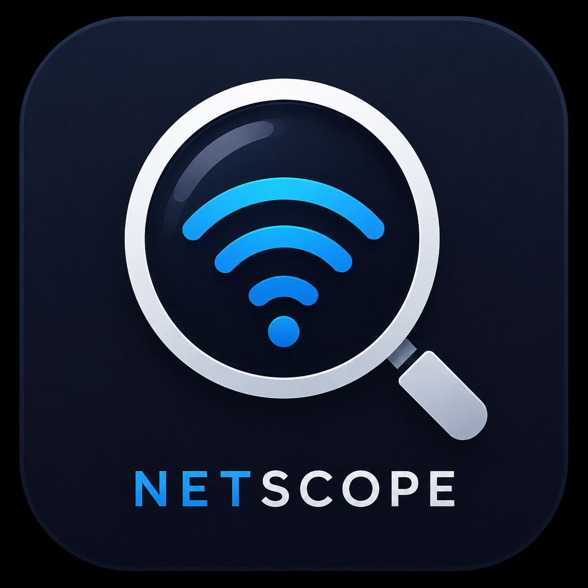
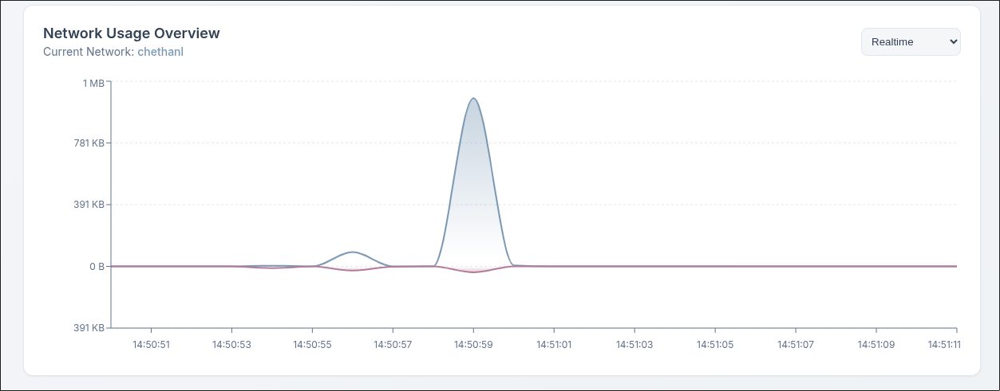
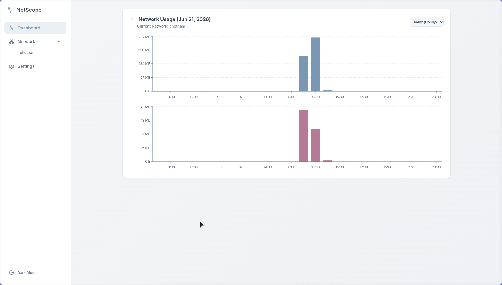
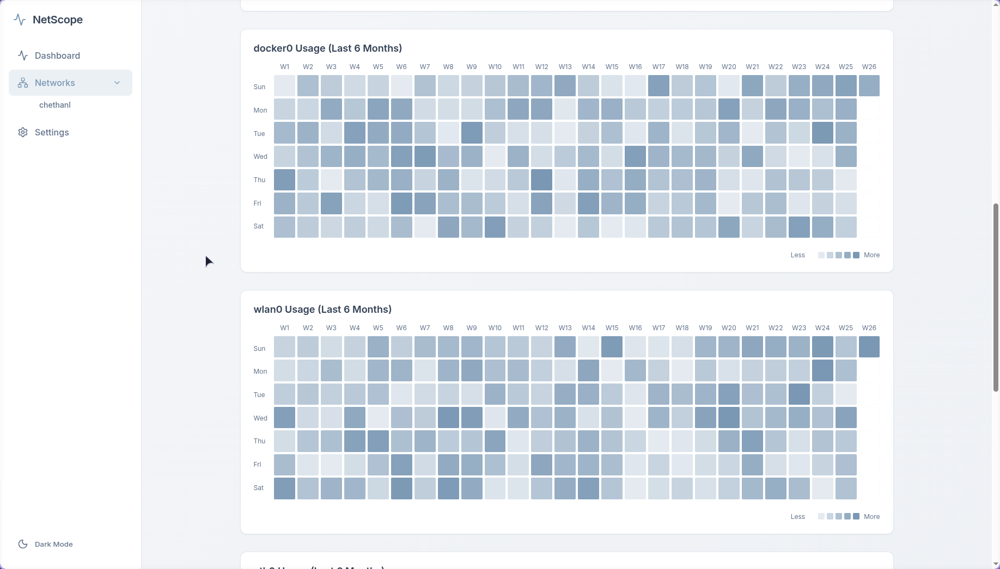
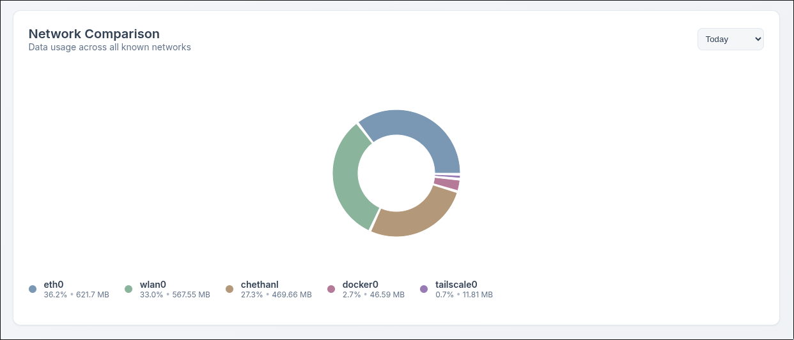
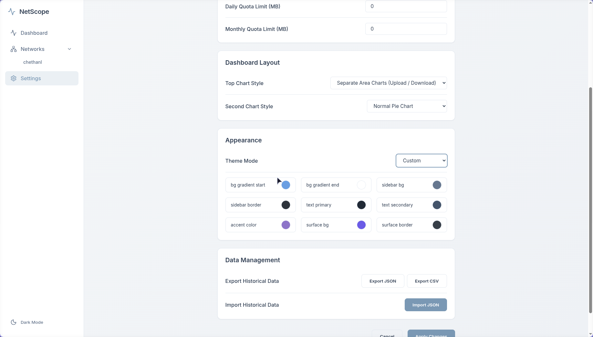
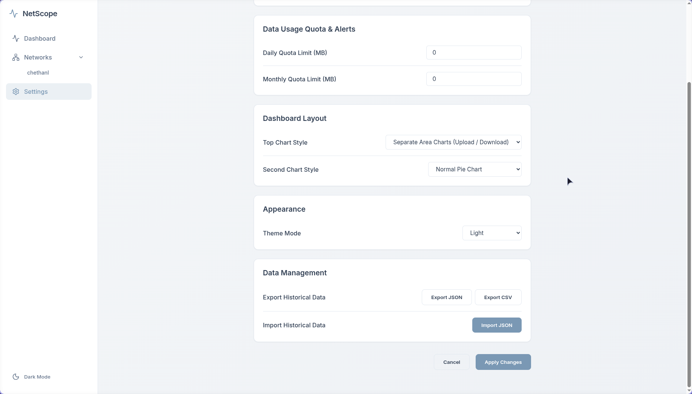
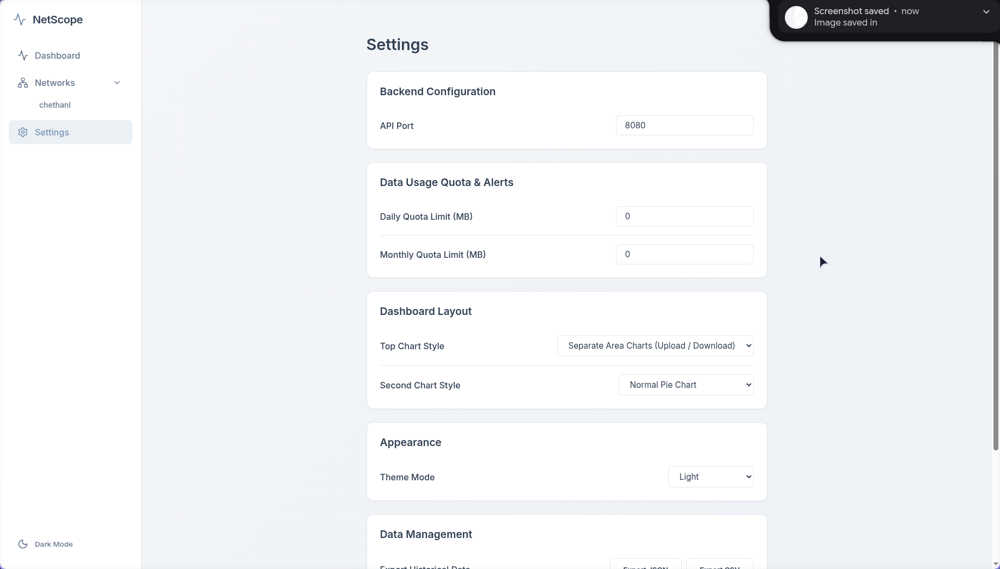

# NetScope
<p align="center"></p>

NetScope is a modern, lightweight, and highly customizable network data monitor. Built with a robust Go backend and a sleek React/Electron frontend, NetScope keeps a watchful eye on your data consumption across all network interfaces—visualizing your usage beautifully while running transparently in the background.

## Features

* **Global Dashboard & Heatmaps:** Get a GitHub-style 6-month historical heatmap of your daily data consumption across your active network interfaces.
* **Real-Time Monitoring:** View live, second-by-second Rx/Tx bandwidth graphs for any connected network interface.
* **Custom Quotas & Desktop Alerts:** Set custom Daily and Monthly data limits (in MB). The backend natively hooks into D-Bus to send you desktop notifications when you reach 80%, 90%, and 100% of your allowance.
* **Theme Syncing & Customization:** Natively syncs with your OS System theme (Dark/Light) or lets you craft a completely custom UI color palette.
* **NixOS Native:** Includes a `flake.nix` that bundles the frontend, backend, and a `systemd.user.services` daemon out of the box for native NixOS integration. 
* **Data Management:** Export your entire network history to JSON/CSV for manual analysis, or import previous backups seamlessly from the UI.
* **Lightweight Storage:** Uses a hyper-efficient SQLite database under the hood to store minute, hourly, and daily bandwidth rollups without bloating your disk.

## Showcase

### Quick Demo
<video src="https://raw.github.com/Chethan-L701/netscope/main/docs/video/demo.mp4" width="640" height="360" controls>
</video>
### Dashboard Overview




### Real-time Analytics


### Settings & Customization




## Getting Started

### Prerequisites
* Nix / NixOS (Flakes enabled)
* NetworkManager (for interface statistics)

### Running & Building

**Method 1: Run directly via Nix (Recommended)**
You can launch NetScope directly from the repository without cloning it:
```bash
nix run github:Chethan-L701/netscope
```

**Method 2: Clone & Build from source**
If you want to modify or run from a local copy:
```bash
git clone https://github.com/Chethan-L701/netscope.git
cd netscope
nix build .#
./result/bin/netscope
```

### NixOS Module
You can run the NetScope backend natively as a user service in NixOS. Simply import the flake module into your NixOS configuration:

```nix
{
  inputs.netscope.url = "path/to/netscope";

  outputs = { self, nixpkgs, netscope, ... }: {
    nixosConfigurations.my-host = nixpkgs.lib.nixosSystem {
      system = "x86_64-linux";
      modules = [
        netscope.nixosModules.default
        {
          services.netscope.enable = true;
          services.netscope.port = 8080;
        }
      ];
    };
  };
}
```

## Architecture
- **Backend:** Go, `mattn/go-sqlite3`, `godbus/dbus/v5`
- **Frontend:** React, Recharts, Vite, Electron

## AI Disclaimer
This project was primarily built and architected in collaboration with an AI coding assistant (Google DeepMind's Antigravity).
